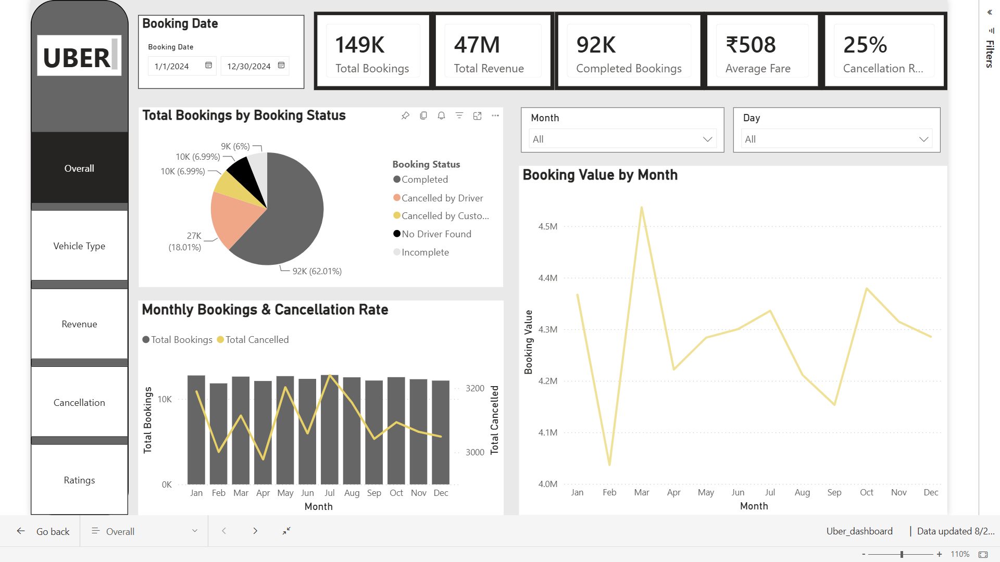
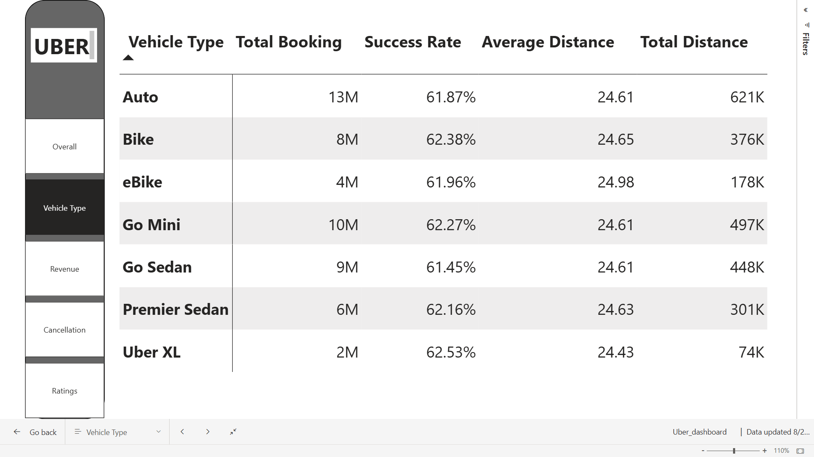
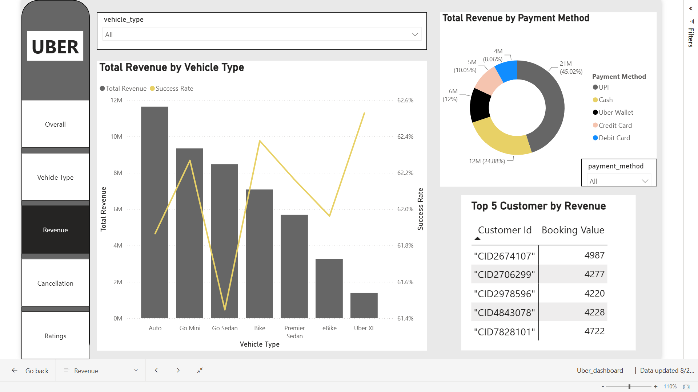
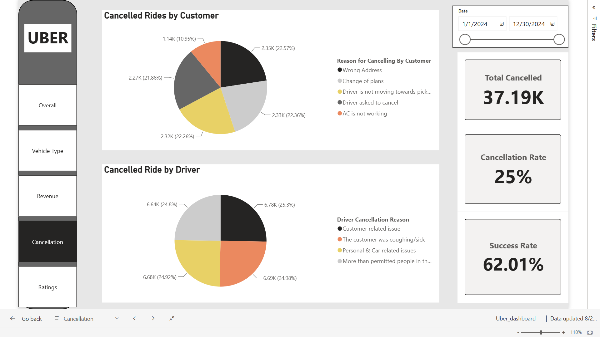
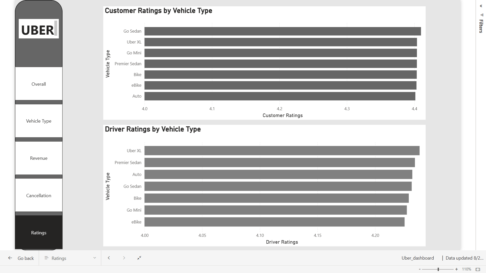

# Uber Ride Booking & Revenue Analysis

## Project Overview

This project analyzes Uber ride booking data to understand booking performance, revenue trends, customer behavior, cancellation patterns, vehicle performance, and ratings.

The project combines SQL-based data analysis with an interactive Power BI dashboard to transform raw booking data into meaningful business insights.

---

## Business Objectives

- Analyze overall booking performance
- Understand revenue trends and fare patterns
- Identify booking and cancellation patterns
- Compare vehicle type performance
- Analyze customer and driver ratings
- Identify time-based booking trends
- Understand high-demand locations

---

## Tools & Technologies

- **MySQL** – Data validation and SQL analysis
- **SQL** – Data exploration and business analysis
- **Power BI** – Interactive dashboard and visualization
- **DAX** – Measures and calculated analysis

---

## SQL Analysis

The project includes SQL analysis for:

- Data validation
- Booking analysis
- Revenue analysis
- Customer analysis
- Cancellation analysis
- Location and time analysis
- Advanced SQL analysis

### SQL Concepts Used

- Aggregate Functions
- GROUP BY
- CASE WHEN
- CTEs
- Subqueries
- JOINs
- Window Functions
- Views

---

##  Power BI Dashboard

The Power BI dashboard contains five analytical sections:

### 1. Overall
Provides a high-level view of:

- Completed Bookings
- Cancellation Rate
- Monthly booking and revenue trends

### 2. Vehicle Type
Analyzes booking and revenue performance across different vehicle categories.

### 3. Revenue
Examines revenue trends, booking value, and fare performance.

### 4. Cancellation
Analyzes cancellation rates and cancellation reasons.

### 5. Ratings
Provides insights into customer and driver ratings.

---

## Dashboard Preview

### Overall Dashboard



### Vehicle Type Analysis



### Revenue Analysis



### Cancellation Analysis



### Ratings Analysis



---


---

## Key Business Insights

- The dataset contains approximately **150K bookings**.
- Approximately **93K bookings were completed**.
- The overall cancellation rate is approximately **38%**.
- Total booking revenue is approximately **₹47M**.
- Average fare is approximately **₹508**.
- Booking and revenue patterns vary across vehicle categories and time periods.
- Cancellation analysis highlights opportunities to improve booking completion and service efficiency.

---

## Business Recommendations

- Reduce cancellations by addressing the major customer and driver cancellation reasons.
- Optimize driver availability during periods of high booking demand.
- Focus on high-performing vehicle categories to improve revenue contribution.
- Improve operational planning around high-demand locations.
- Monitor booking and cancellation trends regularly to improve ride fulfillment.

---

##  Project Structure

```text
Uber-Business-Analysis-SQL-PowerBI/
│
├── images/
│   ├── 01overall.png
│   ├── 02vehicle_type.png
│   ├── 03revenue.png
│   ├── 04reason.png
│   ├── 05ratings.png
│ 
│
├── 01_Data_Validation.sql
├── 02_Booking_Analysis.sql
├── 03_Revenue_Analysis.sql
├── 04_Customer_Analysis.sql
├── 05_Cancellation_Analysis.sql
├── 06_Location_Time_Analysis.sql
├── 06_Advanced_SQL.sql
│
└── Uber_dashboard.pbix
